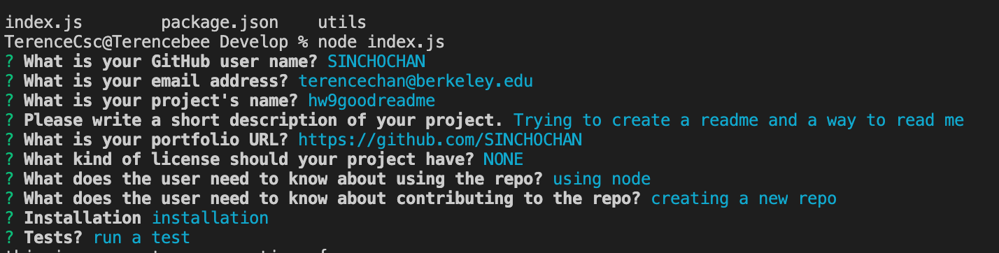
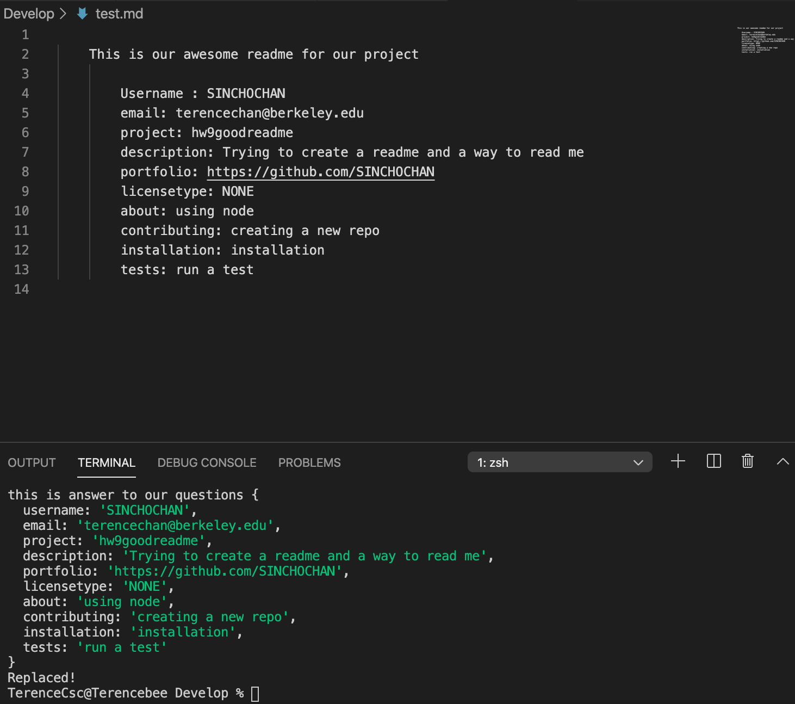

# Project Title
09 Node.js and ES6+ Homework: Good README Generator


# This is the link to the github repo:

https://github.com/SINCHOCHAN/09hw


# This is the link to the live website:

https://sinchochan.github.io/09hw/


Create a command-line application that dynamically generates a README.md from a user's input. The application will be invoked with the following command:

```sh
node index.js
```

The user will be prompted for their GitHub username, which will be used to make a call to the GitHub API to retrieve their email and profile image. They will then be prompted with questions about their project.

The README will be populated with the following:

# The generated README includes 1 badge that's specific to the repository.

# Tables of Contents
* [Username](#username)
* [Email](#email)
* [Project](#project)
* [Description](#description)
* [Portfolio](#portfolio)
* [Licensetype](#licensetype)
* [About](#About)
* [Contributing](#contributing)
* [Installation](#installation)
* [tests](#tests)


## Business Context

When creating an open source project on GitHub, it is important to have a quality README with information about the app--what is the app for, how to use the app, how to install it, how to report issues, and how to make contributions so that other developers are more likely to use and contribute to the success of the project. A command-line application will allow for quick and easy generation of a project README to get started quickly. This will allow a project creator to spend more time working on finishing the project and less time creating a good README.

## Minimum Requirements

* Functional, deployed application.

* GitHub repository with a unique name and a README describing project.

* The generated README includes a bio image from the user's GitHub profile.

* The generated README includes the user's email.

* The generated README includes the following sections: 
  * Title
  * Description
  * Table of Contents
  * Installation
  * Usage
  * License
  * Contributing
  * Tests
  * Questions

* The generated README includes 1 badge that's specific to the repository.

```
GIVEN the developer has a GitHub profile and a repository

WHEN prompted for the developer's GitHub username and repo specific information

THEN a README for the repo is generated
```
- - -

# How to run (screenshot)




